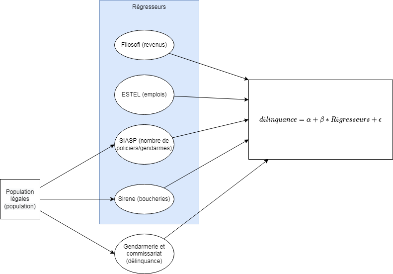

# python-datascience-ENSAE-2A
Bienvenue sur notre projet Python de Datascience en 2ème année de l'ENSAE. Ce projet est réalisé dans un cadre pédagogique et n'engage nullement l'ENSAE ou l'Insee. 

***Clause de non-responsabilité :***
L'étude présentée ici engage uniquement la responsabilité des auteurs et non de leur employeur ou de l'organisme formateur.
Cette étude s'inscrit dans une démarche se voulant scientifique et à l'écart de toutes polémiques éventuelles et traduit une expérience de pensée cherchant à tirer au maximum profit des données publiques rendues disponibles aux citoyens.

***Contexte et objectif :***

En mai 2021, le ministre de l'Intérieur déclarait faire davantage confiance au "bon sens des bouchers charcutiers" plutôt qu'aux statistiques de victimation de l'Insee et du SSMSI pour mesurer le sentiment d'insécurité. L'objectif de ce projet est donc d'étudier la corrélation entre les statistiques de délinquance déclarées auprès des commissariats français, en les rapportant à la répartition des boucheries-charcuteries dans les départements français. 

***Méthodologie :***

1. Collecte de données

2. Analyse descriptive

3. Modélisation

**Collecte de données :** Dans un premier temps, nous collectons les différentes sources utiles à l'étude. Pour cela, nous utilisons principalement des données en OpenData du système statistique public français. Pour la plupart des données socio-économiques, l'Insee produit et diffuse ces données. Les statistiques présentées porteront sur le millésime 2018 dans la mesure où les dernières populations légales datent de 2018 (date du début du projet). 

**Analyse descriptive :** Ensuite, nous analysons et mettons en forme ces données, sous formes de cartes et de graphiques dont notamment des cartographies représentant le nombre de boucheries pour 100 000 habitants au niveau départemental. Nous cartographions également le nombre d'actes de délinquance pour 100 000 habitants et par département. Nous proposons un regroupement en trois classes de département compte tenu de leurs caractéristiques socio-économiques, à l'aide d'une analyse en composantes principales puis d'une classification ascendante hiérarchique.

**Modélisation :** Enfin, nous proposons une modélisation économétrique au niveau départemental  de la corrélation entre délinquance et présence de boucheries-charcuteries et également une approche machine-learning avec une régression LASSO.

## Fonctionnement

Le notebook principal est [main.ipynb](https://github.com/cthiounn/python-datascience-ENSAE-2A/blob/main/main.ipynb) et appelle les autres carnets avec la commande %run. Ces derniers peuvent être lancés séparément mais dans l'ordre chronologique, pour plus de détails avec le paramètre VERBOSE.

## Etude des données au niveau départemental

Champ : France métropolitaine car les données des DOM ne sont pas toujours disponibles

Résultats : Disponibles dans le notebook principal (main.ipynb). Le 4ème résultat pourrait même vous surprendre !

## Etude des données au niveau communal

Seule la partie récupération des données et transformations (appariement et géolocalisation) a été faite compte tenu du temps imparti. La ventilation sur l'ensemble des communes n'a pas été faite.

Pour pouvoir lancer cette partie, il est nécessaire de disposer d'un jeton de l'[API INSEE]((https://api.insee.fr/)) 